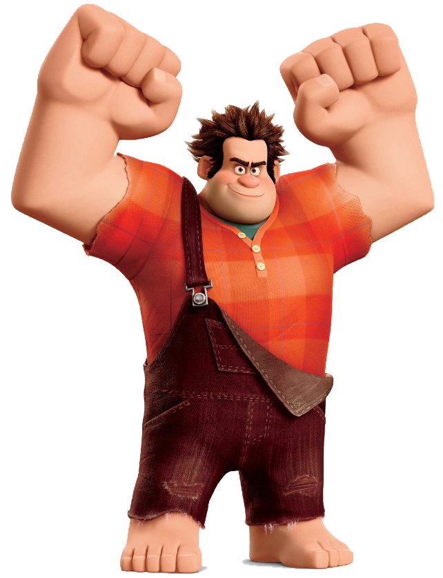

# :punch: Detona Ralph Game

  

Bem-vindo ao **Detona Ralph Game**! Neste repositório, você encontrará um jogo divertido baseado no famoso filme "Detona Ralph".

### Tecnologias Utilizadas

- HTML5 e CSS3 para a estrutura e aparência do jogo.
- JavaScript para a lógica de programação e interatividade.
- Sprites e imagens customizadas para criar a estética única do universo de Detona Ralph.

### Funcionalidades Incríveis

- **Sistema de Pontuação**: Acompanhe sua pontuação à medida que progride no jogo, basta clicar no quadrado em que Ralph se encontra.

### Como Jogar

1. Clone este repositório para sua máquina local.
2. Abra o arquivo `index.html` em seu navegador web.
3. Use o mouse para interagir, clicando nos quadrados.

### Contribuição

Contribuições são bem-vindas! Se você deseja melhorar este jogo, adicionar novos recursos ou corrigir problemas, sinta-se à vontade para abrir um _pull request_.

### Créditos

- Este jogo foi desenvolvido como parte de um projeto educacional da Digital Innovation One.
- O personagem apresentado no jogo pertence exclusivamente à Walt Disney, não sendo reservado à mim nenhum direito sobre ele.

---

Divirta-se jogando **Detona Ralph** enquanto explora as técnicas modernas de desenvolvimento de jogos em JavaScript. Lembre-se de conferir o repositório original [aqui](https://github.com/digitalinnovationone/jsgame-detona-ralph) e deixar uma ⭐️ se você gostou do projeto!
